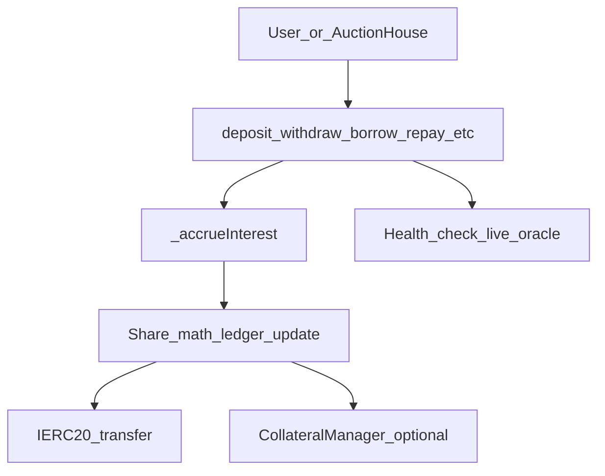

# LendingPool — User Functions Build Specification

*Helix Phase 1 · Single-asset market core · Share/index accounting · Collateral integration*

---

## Why this contract exists

`LendingPool` is the **immutable accounting core** for one borrowable asset market (e.g. USDC). It:

- Holds underlying tokens and tracks **supply** (lenders) and **borrow** (debtors) via shares + global indices
- Accrues interest on interaction (`_accrueInterest`) using a swappable `InterestRateModel`
- Splits borrower interest between **suppliers** and **protocol reserves** (`reserveFactor`)
- Delegates **collateral registration** and **health factor** to `CollateralManager` + `OracleAggregator`
- Exposes **liquidation settlement** entry points for `AuctionHouse` (Phase 2)

**Upgradeability stance:** pool bytecode is **immutable**. Risk modules (`interestRateModel`, `auctionHouse`) are replaceable via governance pointer. Parameters (`reserveFactor`, `dust`) are governance setters (Phase 3 timelock).

**One-line interview stance:** Helix pool accounting never upgrades in place; it accrues via global indices, prices borrows through a swappable IRM, and keeps health checks live-oracle — never cache-authoritative.

---

## Architecture (READ THIS FIRST)

```text
Governance / Guardian
        │
        ├─ pause: new deposits, new borrows (NOT repay / unencumbered withdraw)
        ├─ set interestRateModel, auctionHouse, reserveFactor, dust
        └─ (never) rewrite indexes or seize user funds

User / AuctionHouse
        │
        ▼
LendingPool.{deposit, withdraw, borrow, repay, repayAll, setUseAsCollateral, executeLiquidation}
        │
        ├─► _accrueInterest()          ← always first; idempotent within block
        │       └─► IRM.getBorrowRate  ← see InterestRateModel.spec.md
        │
        ├─► share / ledger math        ← this document
        ├─► IERC20(underlying)         ← custody transfers
        └─► CollateralManager          ← collateral + live HF
                └─► OracleAggregator   ← prices (never stale cache for auth)
```



---

## Relationship to existing implementation

The following is **already implemented** in `src/LendingPool.sol` and tested in `test/unit/AccrueInterest.t.sol`:

| Component | Status |
| :--- | :--- |
| `MarketState` struct (indexes, ledger totals, reserves, timestamp) | Implemented |
| Index init at `RAY` (never zero) | Implemented |
| `VIRTUAL_SHARES` / `VIRTUAL_ASSETS` = `1e18` | Declared |
| `_accrueInterest()` + `_accrueWithDebt()` | Implemented |
| Reserve factor split on accrual | Implemented |
| `deposit()` validation + `_accrueInterest()` | Partial |
| `withdraw`, `borrow`, `repay`, `repayAll`, `setUseAsCollateral`, `executeLiquidation` | Stubs only |

**Out of scope for this doc:** full re-spec of `_accrueInterest` / `_accrueWithDebt` (see accrual tests). Full `CollateralManager` / `OracleAggregator` specs — only **minimal interfaces** defined here.

**Code TODO called out:** `MarketState` comment says "more than three slots" — see § Storage layout for target packing.

---

## Precision domains

Helix uses **three independent precision domains** (main spec). Conversions must truncate in the protocol's favor; drift is bounded, not zero.

| Domain | Unit | Used for |
| :--- | :--- | :--- |
| Underlying assets | token decimals (e.g. `1e6` USDC) | transfers, `dust`, ledger totals |
| Accrual index | `RAY = 1e27` | `borrowIndex`, `supplyIndex`, borrow share conversion |
| Utilization / HF | `WAD = 1e18` | CollateralManager, oracle, kink display |

Constants live in `libraries/HelixLib.sol`: `RAY`, `WAD`, `BASIS_POINTS`.

---

## Shared math

### Ledger semantics

| Field | Meaning |
| :--- | :--- |
| `totalSupplyAssets` | Aggregate supplier claim (grows with deposits + supplier interest) |
| `totalBorrowAssets` | Aggregate borrower debt (grows with borrows + borrow interest) |
| `totalSupplyShares` | Outstanding supply share units |
| `totalBorrowShares` | Outstanding borrow share units |
| `borrowIndex` | Global debt multiplier (starts `RAY`) |
| `supplyIndex` | Global supplier yield multiplier (starts `RAY`) |
| `reserves` | Protocol-owned underlying from reserve factor |

**Cash vs ledger:** when users borrow, **cash** (`IERC20.balanceOf(pool)`) decreases but `totalBorrowAssets` increases — funds remain in the system as receivables. Withdrawals require **sufficient cash** on hand.

```text
cash = IERC20(underlying).balanceOf(pool)
require(cash >= assetsOut)   // on withdraw
require(cash >= amount)      // on borrow
```

**Donation / balanceOf rule:** `totalSupplyAssets` is **ledger-based**, not `balanceOf(pool)`. Direct token transfers to the pool do **not** inflate share exchange rate (share-inflation mitigation). Deposits/repays measure **balance delta** where noted.

---

### Supply side — virtual offset (ERC-4626 style)

Mitigates first-depositor / donation attack (main spec). Constants: `VIRTUAL_SHARES = VIRTUAL_ASSETS = 1e18`.

```text
assetsEff = totalSupplyAssets + VIRTUAL_ASSETS
sharesEff = totalSupplyShares + VIRTUAL_SHARES
```

**User supply balance in underlying:**

```text
userAssets = floor( supplyShares[user] × assetsEff / sharesEff )
```

**Deposit — mint shares (FLOOR):**

```text
sharesMinted = floor( amount × sharesEff / assetsEff )
```

**Withdraw — user specifies `shares`; assets out (FLOOR):**

```text
assetsOut = floor( shares × assetsEff / sharesEff )
```

**Future asset-out API — shares to burn (CEIL):**

```text
sharesBurned = ceil( assets × sharesEff / assetsEff )
```

> **Note:** Current `withdraw(shares, …)` uses **FLOOR** for `assetsOut`. The in-code comment suggesting CEIL for assets out is **incorrect** for a share-in API. CEIL applies when the user requests a fixed **asset** amount (shares burned up).

**Internal helpers (to implement):**

```solidity
function _convertToSupplyShares(uint256 assets, bool roundUp) internal view returns (uint256);
function _convertToSupplyAssets(uint256 shares, bool roundUp) internal view returns (uint256);
function _userSupplyAssets(address user) internal view returns (uint256);
```

Use `HelixMath.rayCeilDiv`-style ceil for supply when `roundUp == true`:

```text
ceil(a, b) = (a + b − 1) / b   // when a, b > 0
```

---

### Borrow side — index shares

Debt uses `borrowIndex` (RAY). Accrual already keeps `totalBorrowAssets` in sync with the index.

**User debt in underlying:**

```text
userDebt = floor( borrowShares[user] × borrowIndex / RAY )
```

**Borrow — mint shares (CEIL):**

```text
sharesMinted = ceil( amount × RAY / borrowIndex )
```

**Repay — burn shares (FLOOR):**

```text
sharesBurned = floor( repayAmount × RAY / borrowIndex )
```

**Internal helpers (to implement):**

```solidity
function _convertToBorrowShares(uint256 assets, bool roundUp) internal view returns (uint256);
function _userBorrowAssets(address user) internal view returns (uint256);
```

Add to `HelixMath.sol`:

```solidity
function rayCeilDiv(uint256 a, uint256 b) internal pure returns (uint256) {
    if (a == 0) return 0;
    return (a + b - 1) / b;  // only when dividing by RAY: (a + RAY - 1) / RAY
}
```

For `ceil(amount * RAY / borrowIndex)`: use `(amount * RAY + borrowIndex - 1) / borrowIndex`.

---

### Ledger updates per operation

| Operation | `totalSupplyAssets` | `totalSupplyShares` | `totalBorrowAssets` | `totalBorrowShares` |
| :--- | :--- | :--- | :--- | :--- |
| `deposit` | `+= amountReceived` | `+= sharesMinted` | — | — |
| `withdraw` | `−= assetsOut` | `−= shares` | — | — |
| `borrow` | — | — | `+= amount` | `+= sharesMinted` |
| `repay` / `repayAll` | — | — | `−= actualRepaid` | `−= sharesBurned` |
| `executeLiquidation` | — | — | `−= debtCleared` | `−= sharesBurned` |

Accrual (`_accrueWithDebt`) updates totals + indexes separately — always run before user ops.

---

## Rounding policy (pool operations)

| Operation | Direction | Rationale |
| :--- | :--- | :--- |
| Supply shares minted (`deposit`) | **down** | Depositor receives no more than paid for |
| Supply assets out (`withdraw` by shares) | **down** | Withdrawer never over-redeems |
| Supply shares burned (asset-out API) | **up** | Withdrawal never over-redeems |
| Borrow shares minted | **up** | Borrower owes at least amount drawn |
| Repay shares burned | **down** | Repayment never over-credits |
| Debt cleared on liquidation | **down** | Dust stays protocol-owed |
| Collateral seized (Phase 2) | **down** | Liquidator never over-collects |
| Interest index advance | **down** | Idempotent within timestamp |

**Invariant:** no user-facing operation, repeated any number of times, leaves the caller with **more value than they started with** (fuzz target).

---

## Pause matrix (guardian scope)

Per main spec: guardian may pause new risk; **never** block repay or unencumbered withdraw.

| Function | Blocked when paused? |
| :--- | :--- |
| `deposit` | **yes** (`whenNotPaused`) |
| `borrow` | **yes** (`whenNotPaused`) |
| `withdraw` | **no** (unencumbered withdraw always allowed) |
| `repay` / `repayAll` | **no** |
| `setUseAsCollateral(true)` | **yes** (new collateral registration = new risk) |
| `setUseAsCollateral(false)` | **no** (user reducing exposure) |
| `executeLiquidation` | **no** (risk reduction must stay live) |

---

## Token compatibility

| Type | Policy |
| :--- | :--- |
| Fee-on-transfer | **Unsupported** for listed markets |
| Rebasing | **Unsupported** |
| ERC-777 / callbacks | Mitigated by `ReentrancyGuard`; still unsupported as underlying |

**Deposit / repay:** measure `balanceAfter − balanceBefore` on the pool; mint/burn on **received** amount, not requested amount.

---

## Storage layout

### Current `MarketState` (4 slots)

```solidity
struct MarketState {
    uint128 borrowIndex;           // slot 0 low
    uint128 supplyIndex;           // slot 0 high
    uint128 totalSupplyAssets;     // slot 1 low
    uint128 totalBorrowAssets;     // slot 1 high
    uint128 totalSupplyShares;     // slot 2 low
    uint128 totalBorrowShares;     // slot 2 high
    uint128 reserves;              // slot 3 low
    uint40  lastUpdateTimestamp;   // slot 3 high (88 bits reserved)
}
```

Indexes initialize to `RAY` — **never zero** (Helix / Genius storage rule).

### New user state (separate slots — mappings)

```solidity
mapping(address => uint256) supplyShares;
mapping(address => uint256) borrowShares;
mapping(address => uint8)  usingAsCollateral;  // see below
mapping(address => mapping(address => uint256)) supplyShareAllowance;  // optional ERC-20-style
```

**`usingAsCollateral` encoding (Genius rule: 0 = non-existent):**

| Value | Meaning |
| :--- | :--- |
| `0` | Never set / default off |
| `1` | Explicitly disabled |
| `2` | Enabled — supply counts as collateral for this market |

Use `== 2` for enabled checks; do not use raw `bool`.

### Module pointers (mutable, governance)

```solidity
address public interestRateModel;  // exists
address public auctionHouse;       // Phase 2 — timelock setter
```

Immutable: `underlying`, `collateralManager`, `oracle`.

---

## Minimal interfaces

### `ICollateralManager` (Phase 1 stub)

```solidity
interface ICollateralManager {
    function addCollateral(address user, address asset, uint256 amount) external;
    function removeCollateral(address user, address asset, uint256 amount) external;
    function updateBorrow(address user, int256 deltaDebt) external;
    function getHealthFactor(address user) external view returns (uint256 hfWad);
    function seizeCollateral(address borrower, address recipient, uint256 amount) external;
}
```

**Health factor rules (main spec):**

- `hfWad >= WAD` (1e18) → healthy
- **Cache in position packing is never authoritative** — liquidation/borrow/withdraw auth must call `getHealthFactor` with **live oracle** every time
- Pool wrappers: `_requireHealthy(user)`, `_requireUnhealthy(user)`

### Events

| Event | Indexed fields | When |
| :--- | :--- | :--- |
| `Deposit` | `caller`, `onBehalfOf` | `deposit` |
| `Withdraw` | `caller`, `receiver`, `owner` | `withdraw` |
| `Borrow` | `borrower`, `to` | `borrow` |
| `Repay` | `payer`, `borrower` | `repay`, `repayAll` |
| `CollateralStatusChanged` | `user` | `setUseAsCollateral` |
| `Liquidation` | `borrower`, `liquidator` | `executeLiquidation` |

Log packing (stretch): pack `amount` + `shares` in one `uint256` where UI agrees. Accrual emits **nothing** (gas).

---

## Internal helpers (to implement)

| Function | Purpose |
| :--- | :--- |
| `_accrueInterest()` | Done — call at start of every external user fn |
| `_mintSupplyShares(user, shares)` | Update user + total supply shares |
| `_burnSupplyShares(user, shares)` | Revert if insufficient |
| `_mintBorrowShares(user, shares)` | Update user + total borrow shares |
| `_burnBorrowShares(user, shares)` | Revert if insufficient |
| `_transferIn(amount)` | Balance-delta deposit; return received |
| `_transferOut(to, amount)` | `safeTransfer` underlying out |
| `_spendAllowance(owner, spender, shares)` | ERC-20-style for `withdraw` |
| `_requireHealthy(user)` | `getHealthFactor(user) >= WAD` else revert |
| `_requireUnhealthy(user)` | `getHealthFactor(user) < WAD` else revert |

---

# Per-function specifications

---

## `deposit(amount, onBehalfOf)`

### Purpose

Supply underlying to the pool; mint supply shares to `onBehalfOf`. Earn interest pro-rata via `supplyIndex` / ledger growth on accrual.

### Signature

```solidity
function deposit(uint256 amount, address onBehalfOf)
    external nonReentrant whenNotPaused
    returns (uint256 sharesMinted);
```

### Auth

- Any payer (`msg.sender` supplies tokens)
- `onBehalfOf != address(0)`

### Preconditions

- `amount > 0`
- Payer balance ≥ `amount` (pre-check; final amount = balance delta)

### Algorithm

1. `_accrueInterest()`
2. `balanceBefore = underlying.balanceOf(this)`
3. `safeTransferFrom(msg.sender, this, amount)`
4. `amountReceived = balanceAfter − balanceBefore` — revert if `0` (FoT)
5. `sharesMinted = floor(amountReceived × sharesEff / assetsEff)`
6. `supplyShares[onBehalfOf] += sharesMinted`; update `totalSupplyShares`, `totalSupplyAssets`
7. If `usingAsCollateral[onBehalfOf] == 2`:
   - `collateralManager.addCollateral(onBehalfOf, underlying, _userSupplyAssets(onBehalfOf))`
   - Pass **full** supply balance in underlying, not just `amountReceived`
8. Emit `Deposit(msg.sender, onBehalfOf, amountReceived, sharesMinted)`

### Rounding

| Step | Direction |
| :--- | :--- |
| Share mint | **down** |

### Reverts

| Error | Condition |
| :--- | :--- |
| `InvalidAmount` | `amount == 0` or `amountReceived == 0` |
| `InvalidAddress` | `onBehalfOf == address(0)` |
| `InsufficientBalance` | payer cannot fund transfer |
| `EnforcedPause` | guardian paused deposits |

### External calls

- `IERC20` transferFrom
- `CollateralManager.addCollateral` (conditional)

### Walkthrough — first depositor (virtual offset)

**Setup:** empty pool, `VIRTUAL_SHARES = VIRTUAL_ASSETS = 1e18`

**Call:** `deposit(1000e6, alice)`

```text
assetsEff = 0 + 1e18
sharesEff = 0 + 1e18
sharesMinted = floor(1000e6 × 1e18 / 1e18) = 1000e6
```

Alice holds `1000e6` shares. Attacker donates `1e12` directly to pool — **ledger unchanged**, next depositor not inflated.

---

## `withdraw(shares, receiver, owner)`

### Purpose

Burn supply shares; send underlying to `receiver`. May reduce collateral if enabled.

### Signature

```solidity
function withdraw(uint256 shares, address receiver, address owner)
    external nonReentrant
    returns (uint256 assets);
```

### Auth

- `msg.sender == owner` OR `supplyShareAllowance[owner][msg.sender] >= shares`
- Decrement allowance on success

### Preconditions

- `shares > 0`
- `receiver != address(0)`
- `supplyShares[owner] >= shares`

### Algorithm

1. `_accrueInterest()`
2. `assets = floor(shares × assetsEff / sharesEff)` — **FLOOR**
3. `cash = underlying.balanceOf(this)` — require `cash >= assets`
4. If `borrowShares[owner] != 0` OR `usingAsCollateral[owner] == 2`:
   - Simulate post-withdraw supply/collateral
   - If `usingAsCollateral[owner] == 2`: compute collateral removal = proportional or full supply delta (document in CollateralManager spec)
   - `_requireHealthy(owner)` after simulation — **unless** user has zero debt and fully exits
5. Burn shares; update ledger totals
6. If collateral enabled: `removeCollateral(owner, underlying, collateralDelta)`
7. `_transferOut(receiver, assets)`
8. Emit `Withdraw`

### Rounding

| Step | Direction |
| :--- | :--- |
| Assets out (share-in API) | **down** |

### Reverts

| Error | Condition |
| :--- | :--- |
| `InsufficientShares` | `supplyShares[owner] < shares` |
| `InsufficientLiquidity` | `cash < assets` |
| `Unhealthy` | HF < 1 after simulated withdraw |
| `InvalidAmount` / `InvalidAddress` | zero shares / zero receiver |

### Pause

**Not pausable** — guardian cannot block unencumbered withdraw.

### Walkthrough — supplier, no debt

**Setup:** Alice has `500e6` shares; pool cash ≥ her asset balance; no borrow position.

**Call:** `withdraw(500e6, alice, alice)`

**Expect:** full underlying out; shares zero; no HF check needed.

---

## `borrow(amount, to)`

### Purpose

Draw `amount` underlying from pool liquidity; mint borrow shares to `msg.sender`.

### Signature

```solidity
function borrow(uint256 amount, address to)
    external nonReentrant whenNotPaused;
```

### Auth

- `msg.sender` is the borrower (no borrow-on-behalf in MVP)

### Preconditions

- `amount > 0`
- `to != address(0)`
- If `borrowShares[msg.sender] == 0`: require `amount >= dust`
- `cash >= amount`

### Algorithm

1. `_accrueInterest()`
2. Dust check for new borrowers
3. `sharesMinted = ceil(amount × RAY / borrowIndex)`
4. Update `borrowShares[msg.sender]`, totals, `totalBorrowAssets += amount`
5. `collateralManager.updateBorrow(msg.sender, +int256(amount))`
6. `_transferOut(to, amount)`
7. `_requireHealthy(msg.sender)` — live oracle, HF ≥ WAD
8. Emit `Borrow`

### Rounding

| Step | Direction |
| :--- | :--- |
| Borrow shares minted | **up** |

### Reverts

| Error | Condition |
| :--- | :--- |
| `BelowDust` | new borrower, `amount < dust` |
| `InsufficientLiquidity` | `cash < amount` |
| `Unhealthy` | HF < 1 after borrow |
| `EnforcedPause` | paused |

### Walkthrough

**Setup:** Pool supply `1_000_000e6`, borrow `400_000e6`, cash `600_000e6`, dust `100e6`

**Call:** `borrow(200_000e6, bob)` — Bob has collateral enabled and HF > 1

**Expect:**

- Bob receives `200e6` USDC
- `totalBorrowAssets += 200_000e6`
- Next `_accrueInterest` uses higher utilization → higher IRM rate

---

## `repay(amount, borrower)`

### Purpose

Repay borrower debt up to `amount`; burn borrow shares.

### Signature

```solidity
function repay(uint256 amount, address borrower)
    external nonReentrant
    returns (uint256 actualRepaid);
```

### Auth

- Any payer (`msg.sender` pays)

### Preconditions

- `amount > 0`
- `borrower != address(0)`
- `borrowShares[borrower] > 0`

### Algorithm

1. `_accrueInterest()`
2. `debt = _userBorrowAssets(borrower)` — revert if `0`
3. `actualRepaid = min(amount, debt)`
4. `sharesBurned = floor(actualRepaid × RAY / borrowIndex)`
5. Burn shares; `totalBorrowAssets -= actualRepaid`; update totals
6. **Dust check:** `remaining = debt − actualRepaid`
   - If `remaining == 0`: OK
   - If `remaining >= dust`: OK
   - If `0 < remaining < dust`: **revert** `DustRemaining` — use `repayAll`
7. `collateralManager.updateBorrow(borrower, −int256(actualRepaid))`
8. `_transferIn(actualRepaid)` from `msg.sender`
9. Emit `Repay`

### Rounding

| Step | Direction |
| :--- | :--- |
| Shares burned | **down** |

### Reverts

| Error | Condition |
| :--- | :--- |
| `NoDebt` | borrower has no borrow shares |
| `DustRemaining` | partial repay leaves `(0, dust)` debt |
| `InvalidAmount` | `amount == 0` |

### Pause

**Never pausable.**

### Walkthrough — dust revert

**Setup:** Bob debt = `150e6`, `dust = 100e6`

**Call:** `repay(60e6, bob)` → remaining `90e6 < dust`

**Expect:** revert `DustRemaining`

**Call:** `repayAll(bob)` → debt zero

---

## `repayAll(borrower)`

### Purpose

Close borrower debt completely in one call.

### Signature

```solidity
function repayAll(address borrower)
    external nonReentrant
    returns (uint256 repaidAmount);
```

### Algorithm

1. `_accrueInterest()`
2. `debt = _userBorrowAssets(borrower)` — revert if `0`
3. `sharesBurned = borrowShares[borrower]` (all shares)
4. Clear borrower shares; `totalBorrowAssets -= repaidAmount`; update totals
5. `updateBorrow(borrower, −debt)`; `_transferIn(debt)`
6. Emit `Repay`

### Walkthrough

**Setup:** FAST FORWARD 7 days (`vm.warp`) after borrow; accrue on repay.

**Expect:** `repaidAmount` = accrued debt (principal + interest); `borrowShares[borrower] == 0`.

---

## `setUseAsCollateral(user, enabled)`

### Purpose

Mark supplier balance in this market as collateral for cross-margin / isolated positions (via CollateralManager).

### Signature

```solidity
function setUseAsCollateral(address user, bool enabled)
    external nonReentrant;
```

### Auth

- `msg.sender == user`

### Algorithm

1. `_accrueInterest()` — supply balance must include accrued interest
2. If `enabled`:
   - Require `!paused` (new risk)
   - `usingAsCollateral[user] = 2`
   - `addCollateral(user, underlying, _userSupplyAssets(user))`
3. If `!enabled`:
   - **Always allowed** (even when paused)
   - If user has debt: simulate removal; `_requireHealthy(user)`
   - `usingAsCollateral[user] = 1`
   - `removeCollateral(user, underlying, previousRegisteredAmount)`
4. Emit `CollateralStatusChanged`

### Walkthrough

1. Alice `deposit` → `setUseAsCollateral(alice, true)`
2. Alice `borrow` at dust floor with HF ≥ 1
3. Alice tries `setUseAsCollateral(alice, false)` while HF < 1 → **revert**

---

## `executeLiquidation(borrower, debtToCover, collateralToSeize)`

### Purpose

Settlement hook for Phase 2 `AuctionHouse`. Burns borrower debt; coordinates collateral seizure. Phase 1: **stub** that validates auth + HF + dust rules; full token flow in Phase 2.

### Signature

```solidity
function executeLiquidation(
    address borrower,
    uint256 debtToCover,
    uint256 collateralToSeize
) external nonReentrant;
```

### Auth

- `msg.sender == auctionHouse` only

### Phase 1 stub scope

- Accrue; verify unhealthy; burn debt shares for `debtToCover`; enforce dust rule; emit event
- **Defer:** auction payment transfer, `seizeCollateral` token movement (interface call may be no-op mock)

### Phase 2 full behavior

1. `_accrueInterest()`
2. `_requireUnhealthy(borrower)` — live HF **< WAD**
3. `debtToCover = min(debtToCover, userDebt)`
4. `sharesBurned = floor(debtToCover × RAY / borrowIndex)`
5. Burn shares; update ledger
6. **Dust rule:** if `0 < remainingDebt < dust` → set `debtToCover = fullDebt` and burn **all** shares (full close)
7. Partial liquidation (Phase 2): remaining debt must be `0` OR `>= dust` (main spec)
8. `seizeCollateral(borrower, msg.sender, collateralToSeize)` — **FLOOR** on seized amount
9. Underlying payment: auction house **pre-transfers** debt asset to pool before call
10. Emit `Liquidation`

### Rounding

| Step | Direction |
| :--- | :--- |
| Debt shares burned | **down** |
| Collateral seized | **down** |

### Pause

**Never pausable** — liquidations must remain live.

### Walkthrough — dust on partial liquidation

**Setup:** Borrower debt = `550e6`, `dust = 100e6`. Liquidator covers `500e6` → remaining `50e6 < dust`.

**Expect:** pool clears **full** `550e6` debt (full close), not partial.

---

## Walkthrough examples (Foundry mental model)

### Example 1 — Deposit, wait, withdraw (no-free-lunch)

```solidity
// Alice deposits 1_000_000e6
pool.deposit(1_000_000e6, alice);
vm.warp(block.timestamp + 30 days);
// Bob borrows (creates utilization / interest)
pool.deposit(500_000e6, bob); // triggers accrue for alice's index
pool.borrow(400_000e6, bob);
vm.warp(block.timestamp + 30 days);
// Alice withdraws all shares
(uint256 assets) = pool.withdraw(aliceShares, alice, alice);
// assert: assets <= 1_000_000e6 + earnedInterest
// assert: alice never gained more than pro-rata supplier share
```

### Example 2 — Collateral path

```text
deposit → setUseAsCollateral(true) → borrow(dust) → HF check passes
borrow(maxUnhealthy) → revert Unhealthy
```

### Example 3 — Repay dust path

```text
borrow → warp 7 days → repay(partial leaving < dust) → revert DustRemaining
→ repayAll → borrowShares == 0
```

### Example 4 — Two suppliers, reserve factor

```text
reserveFactor = 1000 (10%)
Alice 60% shares, Bob 40% shares
After accrual: interest split 60/40 of (borrowInterest - reserveIncrease)
reserves monotonically increase
```

### Example 5 — Liquidation full close

```text
Unhealthy position, partial debtToCover leaves < dust
→ executeLiquidation clears entire debt
```

---

## Invariants (map to main spec)

| # | Invariant | Applies after |
| :--- | :--- | :--- |
| 1 | `totalBorrowAssets >= sum(borrowShares × borrowIndex / RAY)` (directional) | all ops |
| 2 | `totalBorrowAssets - implied < DRIFT_BOUND` | fuzz |
| 3 | `totalSupplyAssets >= sum(supplyShares × assets / sharesEff)` (directional) | all ops |
| 4 | Healthy positions: collateral value ≥ debt value (CollateralManager) | borrow/withdraw/disable collateral |
| 5 | Round-trip deposit→withdraw / borrow→repay: caller gains nothing | fuzz |
| 6 | `reserves` monotonic except governance withdrawal | accrual + ops |
| 7 | Indexes non-decreasing; idempotent within timestamp | accrual |

---

## Test requirements

### Unit tests

| File | Coverage |
| :--- | :--- |
| `test/unit/LendingPoolDeposit.t.sol` | mint FLOOR, virtual offset, FoT revert, first depositor |
| `test/unit/LendingPoolWithdraw.t.sol` | FLOOR assets, liquidity, allowance, HF block |
| `test/unit/LendingPoolBorrowRepay.t.sol` | CEIL mint, dust, repay, DustRemaining, repayAll |
| `test/unit/LendingPoolCollateral.t.sol` | enable/disable, pause matrix |
| `test/unit/LendingPoolLiquidation.t.sol` | unhealthy auth, dust full-close (stub) |

### Integration

- Extend `AccrueInterest.t.sol` with deposit→borrow→warp→repay path
- Mock `ICollateralManager` returning configurable HF

### Fuzz / invariant (Phase 1 gate)

- `test/invariant/LendingPoolHandler.sol` — random deposit/borrow/repay/warp sequences
- Assert invariants 1–7 directional form

---

## Gas / implementation checklist

- [ ] `_accrueInterest` emits **no event**
- [ ] Cache `MarketState` in memory at start of user fn; single writeback where possible
- [ ] `usingAsCollateral` as `uint8` (0/1/2), not `bool`
- [ ] Named returns on internal helpers
- [ ] `!= 0` guards before divides
- [ ] Balance-delta on `deposit` / `repay` only
- [ ] Minimize external calls: one CM call per logical action
- [ ] Supply share allowance: `mapping` + `_spendAllowance` (avoid duplicate SLOADs)
- [ ] Do not use `balanceOf(pool)` as `totalSupplyAssets`
- [ ] `nonReentrant` on all externals (already on stubs)
- [ ] Add `HelixMath.rayCeilDiv` / supply `ceilMulDiv` helpers

---

## Open decisions

| # | Question | Decision for Helix |
| :--- | :--- | :--- |
| 1 | Withdraw API: shares in vs assets in? | **Shares in** — matches current signature |
| 2 | Repay dust: revert vs auto-repayAll? | **Revert** `DustRemaining`; direct to `repayAll` |
| 3 | Supply share transfers / approvals? | **ERC-20-style allowance** on supply shares |
| 4 | `auctionHouse` mutability | **Governance setter** (timelock Phase 3) |
| 5 | `MarketState` packing | **4 slots** as documented; mappings separate |
| 6 | Collateral sync on deposit when enabled | Re-register **full** `_userSupplyAssets` |
| 7 | `executeLiquidation` Phase 1 depth | Stub: debt burn + checks; defer token seizure |

---

## File map

```text
contracts/
├── LendingPool.spec.md              ← this document
├── InterestRateModel.spec.md
├── src/
│   ├── LendingPool.sol              ← implement per this spec
│   ├── interfaces/
│   │   ├── IInterestRateModel.sol
│   │   └── ICollateralManager.sol   ← to create
│   └── libraries/
│       └── HelixMath.sol            ← add ceil helpers
└── test/unit/
    ├── AccrueInterest.t.sol         ← existing
    └── LendingPool*.t.sol           ← to create
```

---

## One-line interview answer

> Helix `LendingPool` accrues on every touch via global indices, mints supply shares with ERC-4626 virtual offset, mints borrow shares against `borrowIndex` with protocol-favor rounding, and delegates live health-factor checks to `CollateralManager` — repay and unencumbered withdraw stay unpausable by design.

---

*Spec version: Phase 1 · aligns with [helix_protocol_spec.md](../helix_protocol_spec.md), [InterestRateModel.spec.md](./InterestRateModel.spec.md), and `LendingPool._accrueWithDebt` as implemented.*
