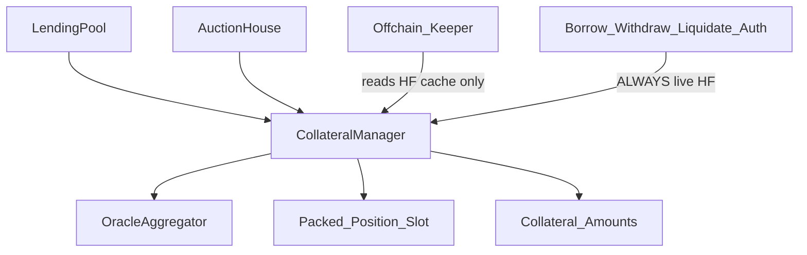

# CollateralManager — Build Specification

*Helix Phase 1 · Isolated + cross-margin positions · Single-slot packing · Live health factor*

---

## Why this contract exists

`CollateralManager` answers three questions for every user:

> **What collateral do they have?**  
> **How much debt do they owe (in value terms)?**  
> **Are they healthy right now (`HF ≥ 1`)?**

It is the **position book** for Helix. It does **not**:

- Hold the borrowable market’s cash (that is `LendingPool`)
- Accrue interest (that is `LendingPool` + `InterestRateModel`)
- Price assets by itself (that is `OracleAggregator`)
- Run Dutch auctions (that is Phase 2 `AuctionHouse`)

It **does**:

- Track per-user collateral amounts (multi-asset)
- Track per-user debt pointers / debt value inputs from markets
- Compute **live** health factor from the oracle on every authorization path
- Cache a **stale** HF hint for keepers only
- Enforce LTV / liquidation-threshold / dust interaction rules when called from pools
- Expose `seizeCollateral` for Phase 2 liquidations

**Upgradeability stance (Helix hybrid):**  
`CollateralManager` may be a long-lived registry. Risk **parameters** (LTV, liquidation threshold, caps) are governance setters. Position **packing layout** is frozen once deployed — new fields require `positionsV2` (main spec storage rule).

---

## Relationship to the rest of Helix (READ THIS FIRST)

```text
User / LendingPool / AuctionHouse
        │
        ▼
CollateralManager
        │
        ├─► positions[user]          ← packed single slot
        ├─► collateral[user][asset]  ← amount enabled as collateral
        ├─► OracleAggregator         ← live prices (WAD / 18-dec valuation)
        └─► (reads debt from markets or cached debt shares × index)

LendingPool.borrow / withdraw / setUseAsCollateral
        └─► getHealthFactor(user)  MUST be live  →  _requireHealthy / _requireUnhealthy

AuctionHouse.executeLiquidation path
        └─► seizeCollateral + getHealthFactor (live, HF < 1)
```



**Debt ownership:**  
Borrow **shares** and **indexes** live on each `LendingPool`. CollateralManager either:

1. **Preferred (Phase 1):** stores a **debt value snapshot in underlying units** updated via `updateBorrow(user, ±delta)` after pool accrual, **or**
2. **Alternative:** stores `(market, borrowShares)` and queries live debt = `shares × borrowIndex / RAY` from the pool.

**Recommendation for Helix Phase 1:** option 1 — `updateBorrow` with **accrued** underlying deltas. Keeps CM free of per-market index SLOADs on every HF check; pool remains source of truth for share math.

---

## Isolated vs cross-margin

Helix Phase 1 requires **both** (main spec).

| Mode | Meaning | How Helix represents it |
| :--- | :--- | :--- |
| **Isolated** | Only one collateral asset may back debt in a market | `mode = 1`; only `primaryAsset` counts toward HF |
| **Cross** | All enabled collateral assets sum into one HF | `mode = 2`; Σ collateral values vs Σ debt values |

```text
mode encoding:
  0 = unset / no position
  1 = isolated
  2 = cross
```

**Default for new borrowers:** cross (`2`) unless user selects isolated before first borrow.

**Isolated constraint:** enabling a second collateral asset while `mode == 1` reverts, **or** auto-upgrades to cross only via explicit `setMarginMode(cross)` (prefer explicit — no silent mode changes).

---

## Precision domains

| Domain | Unit | Used for |
| :--- | :--- | :--- |
| Collateral amounts | asset decimals | `collateral[user][asset]` |
| Valuation / HF / LTV | `WAD = 1e18` | prices, HF, thresholds |
| Debt accounting | market underlying decimals | `updateBorrow` deltas |
| Accrual (pool only) | `RAY = 1e27` | not stored in CM |

```text
collateralValueWad = Σ  floor( amount_i × priceWad_i / 10^decimals_i )
debtValueWad       = Σ  floor( debtUnderlying_m × priceWad_m / 10^decimals_m )

healthFactorWad    = floor( collateralValueWad × liquidationThresholdWad / debtValueWad )
                   = type(uint256).max   if debtValueWad == 0
```

**Rounding (protocol favor):**

| Operation | Direction | Rationale |
| :--- | :--- | :--- |
| Collateral value | **down** | Don’t overstate solvency |
| Debt value | **up** (ceil) when converting for HF | Don’t understate what is owed |
| HF division | **down** | Borderline positions lean unhealthy |
| Collateral seized | **down** | Liquidator never over-collects |

---

## Health factor — the critical rule

```text
HEALTHY   ⇔  hfWad >= WAD     (1e18)
UNHEALTHY ⇔  hfWad <  WAD
```

### Live vs cache (main spec — non-negotiable)

| Field | Purpose | Authoritative for auth? |
| :--- | :--- | :--- |
| `hfCache` in packed position | Keeper triage, off-chain sort, UI hint | **NO** |
| `getHealthFactor(user)` | Recompute from **live oracle** + current collateral/debt | **YES** |

**Comment required in code** next to `hfCache` and on every auth path:

```solidity
// HEALTH FACTOR CACHE IS NEVER AUTHORITATIVE.
// Liquidation / borrow / withdraw / disable-collateral MUST call getHealthFactor (live oracle).
```

Update `hfCache` opportunistically on `addCollateral` / `removeCollateral` / `updateBorrow` / `seizeCollateral` (best-effort). Staleness is expected.

### Liquidation threshold vs LTV

| Param | When used |
| :--- | :--- |
| `ltvWad` | Max debt at **open / increase borrow** (stricter) |
| `liquidationThresholdWad` | HF formula (looser than LTV; creates buffer) |

```text
require(ltvWad < liquidationThresholdWad)   // always
require(liquidationThresholdWad <= WAD)
```

**Borrow path (pool):** after `updateBorrow(+amount)`, require live HF ≥ 1 **and** optionally `debtValue ≤ collateralValue × ltv` (Aave-style). Helix Phase 1 minimum: **HF ≥ 1 with liquidation threshold**; LTV check recommended on borrow increase.

---

## Single-slot position packing

Main spec: pack position into **one 256-bit word**.

### Recommended layout (≤ 256 bits)

```solidity
struct Position {
    // Slot: positions[user]
    uint80 collateralValueCache;  // WAD-scaled, truncated — hint only
    uint80 debtValueCache;        // WAD-scaled, truncated — hint only
    uint32 lastInteract;          // unix timestamp truncated (year 2106 OK)
    uint32 hfCache;               // WAD >> 96 or custom scale — NEVER authoritative
    uint8  mode;                  // 0 unset, 1 isolated, 2 cross
    uint8  flags;                 // bit0: hasDebt, bit1: inAuction, …
    // 80+80+32+32+8+8 = 240 bits → 16 bits reserved
}
```

**Collateral amounts** cannot all fit in one slot for multi-asset cross-margin → separate mapping:

```solidity
mapping(address => mapping(address => uint128)) public collateralAmount;
mapping(address => address) public primaryAsset; // isolated mode
```

**Debt in underlying (Phase 1 recommendation):**

```solidity
mapping(address => mapping(address => uint128)) public debtUnderlying;
// user => market (LendingPool / underlying) => accrued debt units
```

**Why not put amounts in the packed word?**  
Cross-margin needs N assets. Packing one amount would force isolated-only. Helix packs *aggregates + mode + timestamps*, amounts live next door.

**Frozen packing rule:** once deployed, do not reorder/resize fields. New data → `positionsV2`.

---

## Auth model

| Caller | Allowed functions |
| :--- | :--- |
| Registered `LendingPool` (per asset) | `addCollateral`, `removeCollateral`, `updateBorrow` |
| `AuctionHouse` | `seizeCollateral`, optionally `updateBorrow` on settle |
| User | `setMarginMode`, views |
| Governance / timelock | `setAssetConfig`, `setPool`, LTV / threshold / caps |
| Anyone | `getHealthFactor`, `getPosition`, views |

```solidity
mapping(address => uint8) public isPool; // 0 unset, 1 false, 2 true
address public auctionHouse;
address public oracle;
address public governance;
```

---

## Asset config (governance)

```solidity
struct AssetConfig {
    uint64 ltvWad;                    // e.g. 0.75e18
    uint64 liquidationThresholdWad;   // e.g. 0.80e18
    uint64 liquidationBonusWad;       // Phase 2 hint; optional in Phase 1
    uint8  decimals;
    uint8  enabled;                   // 0/1/2
    // pack into ≤1 slot
}
mapping(address => AssetConfig) public assetConfig;
```

Unsupported for listing (main token policy): FoT, rebasing, exotic callbacks as collateral.

---

## Interface (target — expand current stub)

Current stub in `ICollateralManager.sol` is incomplete. Target:

```solidity
interface ICollateralManager {
    function addCollateral(address user, address asset, uint256 amount) external;
    function removeCollateral(address user, address asset, uint256 amount) external;
    function updateBorrow(address user, address market, int256 deltaDebt) external;
    function getHealthFactor(address user) external view returns (uint256 hfWad);
    function getCollateral(address user, address asset) external view returns (uint256);
    function seizeCollateral(
        address borrower,
        address asset,
        address recipient,
        uint256 amount
    ) external returns (uint256 seized);
    function setMarginMode(uint8 mode) external;
}
```

Align `LendingPool` calls: pass `market = address(pool)` or `underlying` consistently — **document one ID scheme** (recommend `underlying` as asset key; `msg.sender` as pool for auth).

---

# Per-function specifications

---

## `addCollateral(user, asset, amount)`

### Purpose

Increase enabled collateral for `user` in `asset` (called by `LendingPool` when supply is marked `usingAsCollateral`, or when depositing collateral-only assets if supported later).

### Auth

- `isPool[msg.sender] == 2`
- `assetConfig[asset].enabled == 2`
- `amount != 0`

### Algorithm

1. If isolated (`mode == 1`) and `primaryAsset[user] != 0` and `asset != primaryAsset[user]` → revert `IsolatedAssetMismatch`
2. If isolated and `primaryAsset[user] == 0` → set `primaryAsset[user] = asset`
3. `collateralAmount[user][asset] += amount` (uint128-safe)
4. Refresh value caches + `hfCache` (best-effort, live oracle)
5. Update `lastInteract`
6. Emit `CollateralAdded` (optional — or silent if pool emits)

### Rounding

Amount is already in asset units from pool — no division.

---

## `removeCollateral(user, asset, amount)`

### Purpose

Decrease enabled collateral. Must leave position healthy if user has debt.

### Auth

- `isPool[msg.sender] == 2`
- `amount != 0`
- `collateralAmount[user][asset] >= amount`

### Algorithm

1. Simulate post-removal amounts
2. If user has debt (`flags.hasDebt` or any `debtUnderlying > 0`):
   - Compute **live** HF with simulated collateral
   - Require `hfWad >= WAD` else revert `Unhealthy`
3. Subtract amount; clear `primaryAsset` if isolated balance hits 0
4. Refresh caches; emit / return

### Pause

Pool may block new risk; removing collateral that **improves** safety should stay allowed when called from unpausable withdraw paths — CM itself has no pause; pool enforces.

---

## `updateBorrow(user, market, deltaDebt)`

### Purpose

Notify CM of accrued debt change in underlying units after pool mint/burn of borrow shares.

### Auth

- `isPool[msg.sender] == 2`
- `deltaDebt != 0`

### Algorithm

1. If `deltaDebt > 0` (borrow):
   - `debtUnderlying[user][market] += uint256(deltaDebt)`
   - Set `flags.hasDebt = 1`
   - **Live** HF (and optional LTV) must satisfy healthy — **caller** typically checks after; CM may also `require` for defense in depth
2. If `deltaDebt < 0` (repay / liquidate):
   - Subtract; floor at 0
   - If all markets zero debt → clear `hasDebt`
3. Refresh caches

**Dust:** debt floor is enforced on `LendingPool` (`dust`). CM should not re-implement dust; after repay, pool guarantees remaining debt is 0 or ≥ dust.

---

## `getHealthFactor(user)`

### Purpose

**Authoritative** solvency check. Always live oracle.

### Auth

Anyone (view).

### Algorithm

1. Load all non-zero `collateralAmount[user][*]` (or iterate registered assets — prefer **bitmap / linked list of user’s assets** for gas; Phase 1 may cap at small `MAX_ASSETS_PER_USER`)
2. For each asset: `price = oracle.getPrice(asset)` (WAD, revert if stale — oracle policy)
3. Sum `collateralValueWad` (**floor** each term)
4. Sum `debtValueWad` across markets (**ceil** each term recommended)
5. If `debtValueWad == 0` → return `type(uint256).max`
6. Else:

```text
hfWad = floor( collateralValueWad × liquidationThresholdWad_effective / debtValueWad )
```

For **cross-margin**, use per-asset liquidation thresholds:

```text
adjustedCollateral = Σ floor( value_i × LT_i / WAD )
hfWad = floor( adjustedCollateral × WAD / debtValueWad )
```

For **isolated**, only `primaryAsset` enters the sum; only that market’s debt counts (or all debt if product choice — **recommend: isolated ties one collateral to one market’s debt**).

### Gas notes

- Cap assets per user (e.g. 8) for Phase 1
- No events
- Named return `hfWad`

---

## `seizeCollateral(borrower, asset, recipient, amount)`

### Purpose

Phase 2 liquidation settlement: reduce borrower collateral; credit recipient accounting (tokens may already move via pool/auction — CM is the **position** update).

### Auth

- `msg.sender == auctionHouse`

### Algorithm

1. Require live `getHealthFactor(borrower) < WAD`
2. `seized = min(amount, collateralAmount[borrower][asset])` — **floor / down**
3. Subtract from borrower
4. Do **not** auto-credit recipient’s collateral unless auction design says so (usually liquidator receives tokens outside CM)
5. Refresh caches
6. Emit `CollateralSeized`

### Dust / partial liquidation (main spec)

After paired `updateBorrow(-debtCleared)`, remaining debt on pool must be `0` or `≥ dust`. CM does not own dust; pool/`executeLiquidation` enforces. CM must allow full collateral wipe.

---

## `setMarginMode(mode)`

### Purpose

User selects isolated (`1`) or cross (`2`).

### Auth

`msg.sender == user` (or operator — out of scope Phase 1).

### Algorithm

1. `mode` must be `1` or `2`
2. If switching to isolated while multiple collateral assets > 0 → revert `TooManyAssetsForIsolated`
3. If switching to isolated with debt on multiple markets → revert
4. Store `positions[user].mode = mode`
5. Emit `MarginModeChanged`

---

## Governance setters (Phase 3 shape — specify now)

| Function | Notes |
| :--- | :--- |
| `setAssetConfig(asset, ltv, lt, decimals, enabled)` | Timelock; validate `ltv < lt ≤ WAD` |
| `setPool(pool, enabled)` | Register LendingPool callers |
| `setAuctionHouse(addr)` | Phase 2 |
| `setOracle(addr)` | Swappable module |

---

## Events

| Event | When |
| :--- | :--- |
| `CollateralAdded` | add |
| `CollateralRemoved` | remove |
| `BorrowUpdated` | updateBorrow |
| `CollateralSeized` | seize |
| `MarginModeChanged` | setMarginMode |
| `AssetConfigUpdated` | governance |

Prefer **minimal** logging (Optimizations.txt). Pack `amount` into one data word where UI allows. HF cache updates: **no event**.

---

## Walkthrough examples (Foundry mental model)

### Example A — Cross-margin healthy borrow

```text
Alice deposits USDC in LendingPool, setUseAsCollateral(true)
  → pool calls addCollateral(alice, USDC, fullSupplyAssets)
Alice deposits WBTC as collateral (future multi-asset) or only USDC
Alice borrow(dust) USDC
  → updateBorrow(alice, usdcMarket, +amount)
  → getHealthFactor(alice) >= 1e18
```

### Example B — Withdraw blocked when unhealthy

```text
Alice has debt; price of collateral drops (mock oracle)
withdraw would call removeCollateral simulation
getHealthFactor < 1e18 → revert Unhealthy
```

### Example C — Isolated mode

```text
setMarginMode(1)
addCollateral(alice, WBTC, X)  // primary = WBTC
addCollateral(alice, USDC, Y)  → revert IsolatedAssetMismatch
```

### Example D — Live HF vs cache

```text
hfCache shows 1.2e18 (stale)
oracle price crashes
getHealthFactor returns 0.9e18
executeLiquidation auth uses LIVE 0.9 — succeeds
Keeper that trusted hfCache alone would be wrong — by design
```

### Example E — Seize on liquidation

```text
AuctionHouse settles
seizeCollateral(alice, WBTC, liquidator, amount)  // amount floored
updateBorrow(alice, market, -debtCleared)
remaining debt on pool 0 or ≥ dust
```

---

## Invariants

| # | Invariant |
| :--- | :--- |
| 1 | For every user with `hasDebt`: live `getHealthFactor` is the only auth signal |
| 2 | Healthy positions after borrow/withdraw/removeCollateral: `hfWad >= WAD` |
| 3 | `collateralAmount` never underflows |
| 4 | Isolated users have at most one non-zero collateral asset |
| 5 | `ltv < liquidationThreshold ≤ WAD` for every enabled asset |
| 6 | Position packing bit layout immutable across upgrades |
| 7 | Sum of seized + remaining collateral = pre-seize amount (conservation) |
| 8 | Phase 3 prep: `stressDelta` (if added later) only in new namespace — not this slot without migration |

Map to main-spec solvency invariant #4: `totalCollateralValue` vs `totalDebtValue` for healthy users.

---

## Test requirements

| File | Coverage |
| :--- | :--- |
| `test/unit/CollateralManagerHealth.t.sol` | HF at 0 debt, below/above 1, rounding floor |
| `test/unit/CollateralManagerIsolated.t.sol` | mode 1 constraints |
| `test/unit/CollateralManagerCross.t.sol` | multi-asset sum |
| `test/unit/CollateralManagerAuth.t.sol` | only pool / auction house |
| `test/unit/CollateralManagerSeize.t.sol` | unhealthy required, floor seize |
| `test/fuzz/CollateralManagerHf.t.sol` | random prices/amounts; healthy ops never leave HF check bypassed |

Mock `OracleAggregator` with settable prices + staleness flag.

---

## Gas / Optimizations.txt checklist

- [ ] Packed `Position` in **one** slot; amounts in mappings
- [ ] `mode` / `enabled` / `isPool` as `uint8` with **0 / 1 / 2** encoding
- [ ] Named returns on views
- [ ] Memory-cache position word once per tx path
- [ ] Prefer `!= 0` over `> 0`
- [ ] Prefer branch `if (hfWad < WAD)` over `<=` where equivalent
- [ ] No events on pure HF cache refresh
- [ ] Cap assets per user to bound HF loop gas
- [ ] Call oracle sparingly (once per asset per HF compute)
- [ ] Constructor `payable` (deployment opt)
- [ ] Centralize `WAD` / thresholds in HelixLib
- [ ] Mutex/`nonReentrant` only if CM holds tokens or calls untrusted externals — prefer **no token custody in CM** so reentrancy surface stays on pools

---

## Open decisions

| # | Question | Recommendation |
| :--- | :--- | :--- |
| 1 | Does CM custody ERC20 collateral? | **No** — accounting only; pools/adapters hold tokens |
| 2 | Debt storage: deltas vs live share query | **Accrued underlying deltas** via `updateBorrow` |
| 3 | Isolated debt scope | One collateral asset ↔ one market’s debt |
| 4 | Max assets per user (Phase 1) | **8** |
| 5 | LTV check on borrow | Yes, in addition to HF ≥ 1 |
| 6 | Where `stressDelta` lives (Phase 3) | New field in `positionsV2` or free bits in reserved 16 |
| 7 | Expand `ICollateralManager` now? | **Yes** — match this spec; update stub |

---

## File map

```text
contracts/
├── CollateralManager.spec.md          ← this document
├── LendingPool.spec.md
├── InterestRateModel.spec.md
└── src/
    ├── CollateralManager.sol          ← implement per this spec
    ├── interfaces/ICollateralManager.sol
    ├── OracleAggregator.sol           ← Phase 1 companion
    └── LendingPool.sol                ← caller
```

*Spec version: Phase 1 · aligns with [helix_protocol_spec.md](../helix_protocol_spec.md), [LendingPool.spec.md](./LendingPool.spec.md), and Helix hybrid upgradeability / Optimizations.txt packing rules.*
